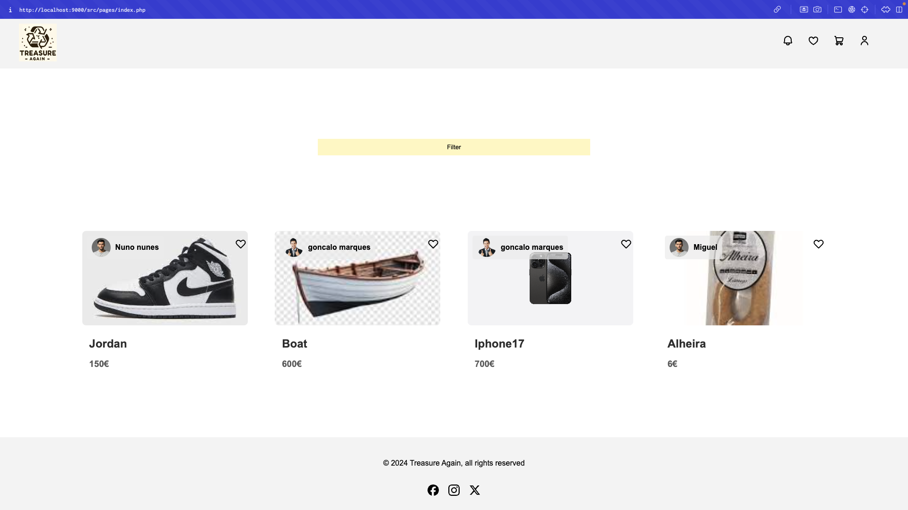

# LTW Project Class 12 G06
* Gonçalo Marques up202206205
* Miguel Duarte up202206102
* Nuno Rios up202206272

## Guide to Instalation Instructions
### First go to the right directory.
```
cd src
cd database
```
  
### Open a terminal and run this
```
.sqlite3
.open database.db
.read database.sql
```

### Run the website
```
cd ../..
php -S localhost:9000
```

## Website HomePage



## Implemented Features

* Account signIn, signUp, logout and edit
* Add new items
* Edit items
* Track and manage your own items
* Make a comment in an item post
* Reply to a comment
* Shipping form after checkout
* Filter items 
* Wishlist and shopping cart
* Admin features
* Add new categories and conditions
* Ban user or elevate user


